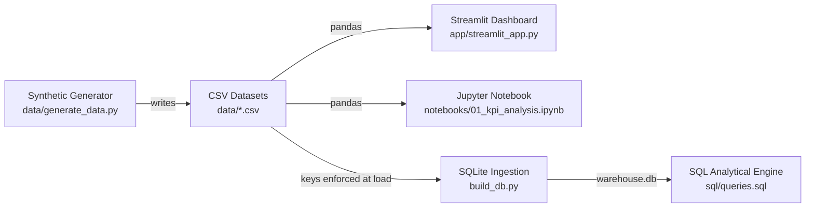

# Warehouse KPI Dashboard 🧊

[](https://www.python.org/)
[](https://streamlit.io/)
[](https://www.sqlite.org/)
[](https://opensource.org/licenses/MIT)

Interactive KPI monitoring and data engineering pipeline for **refrigerated food warehouse operations**: picking accuracy tracking against a **1% error rate SLA**, operator Pareto error analysis, volume by temperature zone, and 30-day **lot expiry risk alerting**.

Modelled on real-world cold-storage logistics operations (temperature zones `-18°C` / `-25°C`, lot expiry control, FIFO prioritization, weekday peak patterns).

---

## 📈 Pipeline Architecture



The CSV files are the single source: the dashboard and the notebook read them with
pandas, while `build_db.py` loads the same files into SQLite for the six analytical
queries and for SQL CLI exploration.

---

## 🎯 Key Operational Questions Answered

- **Error SLA Compliance**: Are picking errors maintained below the strict `< 1.0%` threshold across overall operations, weekly trends, and individual pickers?
- **Error Taxonomy Pareto**: Which root causes drive failures (wrong quantity, wrong SKU, damaged packaging, expired lot)?
- **Volume Distribution**: Volume breakdown by category, picker throughput, and temperature zone (`-18°C` frozen vs `-25°C` deep freeze).
- **Expiry Risk & FIFO Alerting**: Which lots expire within 30 days and require immediate stock rotation / clearance?

---

## 🛠️ Stack

| Layer | Technology |
|-------|------------|
| **Data Engine** | Python 3.10+ (seeded, 100% reproducible) |
| **Database** | SQLite3 schema + 6 commented analytical queries in [`sql/`](sql/) |
| **Analysis** | pandas + matplotlib narrative notebook in [`notebooks/`](notebooks/) (matplotlib ships in `requirements-dev.txt`, the app does not need it) |
| **Dashboard** | Streamlit interactive web application |

---

## 🚀 Quickstart

```bash
# 1. Clone & install dependencies
git clone https://github.com/nqwrc/warehouse-kpi-dashboard.git
cd warehouse-kpi-dashboard
pip install -r requirements.txt

# 2. Launch the dashboard -- it reads the committed data/*.csv directly
streamlit run app/streamlit_app.py
```

The dataset is committed, so the dashboard runs straight after the install. Regenerate it
(byte-identical output, `random.seed(42)`) and build the SQLite database behind the six
queries when you want to explore in SQL:

```bash
python data/generate_data.py
python build_db.py
sqlite3 warehouse.db < sql/queries.sql
```

> **On the foreign keys.** SQLite parses `REFERENCES` but does not enforce it unless
> `PRAGMA foreign_keys = ON` is set, and that setting lives on the connection, not in the
> file — it defaults to OFF for every new one. `build_db.py` switches it on, so the load
> is checked; if you want the same guarantee while exploring, run `PRAGMA foreign_keys = ON;`
> first in the CLI too.

---

## 📁 Repository Structure

```
├── app/
│   └── streamlit_app.py         # Streamlit interactive dashboard
├── data/
│   ├── generate_data.py         # Synthetic dataset generator (seeded)
│   └── *.csv                    # Products, lots, picking order lines
├── sql/
│   ├── schema.sql               # SQLite schema & performance indexes
│   └── queries.sql              # 6 analytical KPI queries with rationale
├── notebooks/
│   └── 01_kpi_analysis.ipynb    # Exploratory data analysis & visualizations
├── tests/                       # pytest suite, pinned to the seeded dataset
├── build_db.py                  # CSV ingestion into warehouse.db
├── requirements.txt             # Runtime dependencies (dashboard + pipeline)
└── requirements-dev.txt         # Test and notebook dependencies
```

---

## 📝 License

Distributed under the **MIT License**. See [`LICENSE`](LICENSE) for details.
